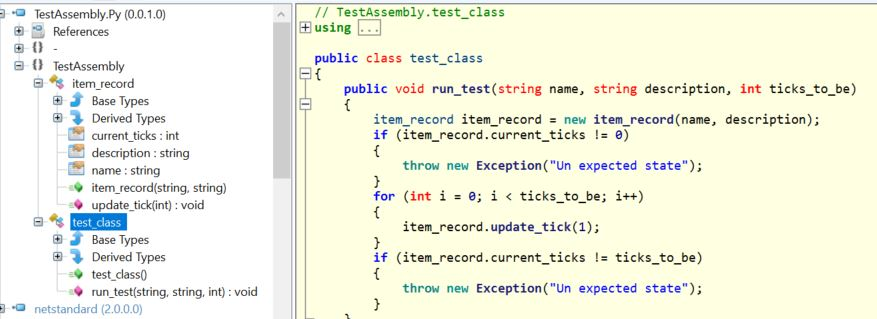

# SharpPythonCompiler

A compiler which can transform the convention of C# code to the convention of Python.

# Life is short. Do we really need Python?
# 人生苦短，何必Python。

# How to use?

## Install it as global tool

    dotnet tool install --global SharpPythonCompiler

## Compile projects with the command line

    sharp-python-compiler TestAssembly.csproj outputDir

You will get a new assembly file "TestAssembly.Py.dll" in the output directory.

## Check out what happened

###### Original Assembly

###### Compiled Assembly

